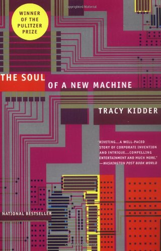

I like to read [books]('https://www.goodreads.com/user/year_in_books/2019/92204653') but easily get bored of those long ones.Well got bore of those heavyweight books like [sicp]('https://mitpress.mit.edu/sites/default/files/sicp/full-text/book/book-Z-H-1.html') or [clrs]('https://www.amazon.com/Introduction-Algorithms-3rd-MIT-Press/dp/0262033844')and need something to relax and devour while sipping coffee but still be related to software.Turns there are many great things in the store. Here is a few of them that I enjoyed and found great. 

## The Soul of a New Machine 
by Tracy Kidder 

This book won Pulitzer Prize so that's says a lot. It follows engineers at Data General Eclipse which have embarked on an incredible journey to make new 32 bit Computer. These engineers are not the regular guys. They are as savvy as they are cool. Their exceptional level of assembly programming matches with their proficeny in terminal games. Not only the feats are great but the author had told the story in a skill matching in level with these iconoclast people and the machine.

## Code: The Hidden Language of Computer Hardware and Software
by Charles Petzold

This is one of my favourite. This kind of answered my great and troubling question of how computers work and were made. Well the books start from morse code (which is  super cool if you don't know) to telegram and then gates to finally a kind of working computer. The explanation is clear and author does not smatter but rather explains things at a good detailed level and in a fun way. 

## Life 3.0
by Max Tegmark

Love to make hypothetical 1984 or utopian situations and how this changes might happen. Well Life 3.0 does some of it while also discussing were the AI will go and why to discuss the role and development of AI is more important than ever and why more people are needed to be included. The book also provides a model of how to look at AI and why many things may be theoritically possible or impossible without requiring to know those models. 

## Homo Deus
by yuval noah harari

Well the book dosen't touches the computer related stuff. What it does is touches the topics were technology and other influencers will change how we will live. Some topics like imortality touches biology but overall due to the fact the book is written by probably one of the greatest writer on the century and the future this seems worth time. Before you believe every thing I say about this book a little not I am only halfway through the book at the time of writing. 

## Hackers: Heroes of the Computer Revolution
by Steven Levy 
So you are a millennial and wanna see how the great old stuff was done (the col hipster way!). This books is all about the revoulutionary and probably the most important cultural impact "the hacker culture" in tech world. There is this [article]('http://www.catb.org/~esr/faqs/hacker-howto.html') and [this]('http://www.paulgraham.com/gh.html') by the legends and the greates hackers which are also great and realated.