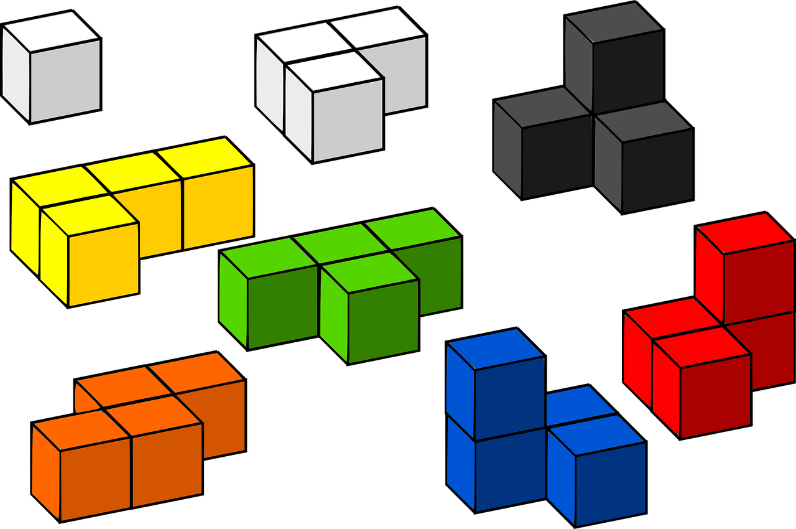

 
 

So I was making tetris a few months back [which you can play here]("https://sttronn.github.io/Tetris/")  (it isin't complete clone but has  nearly all the basic features) while looking up for rules I encountered this [cool effect]("https://en.wikipedia.org/wiki/Tetris_effect").

It describes effect which occurs when people who plays and devote a lot of time on tetris experience thoughts,dreams with identifying geometric shapes and fiting them together much like game. As one describe the effect in the Wired article This is your brain on Tetris "I visually fit cars and trees and people together".

This term is generalized, The Tetris effect occurs when people devote so much time and attention to an activity that it begins to pattern their thoughts,mental images, and dreams.

### Earworm

Many of us usually don't play much tetris or devote concentrated time to an activity for prolonged period but If you listen to music you may have experienced something like this. Ever a catchy music keeps on playing even after it had stoped playing. It could be triggered by lyrics some emotion or even randomly. Also it is hard to stop it happens a lot to me during exam and funny situations. Turns out this effect is recognized and has many names [earworm]("https://en.wikipedia.org/wiki/Earworm"), brainworm and my favourite "stuck song syndrome". 