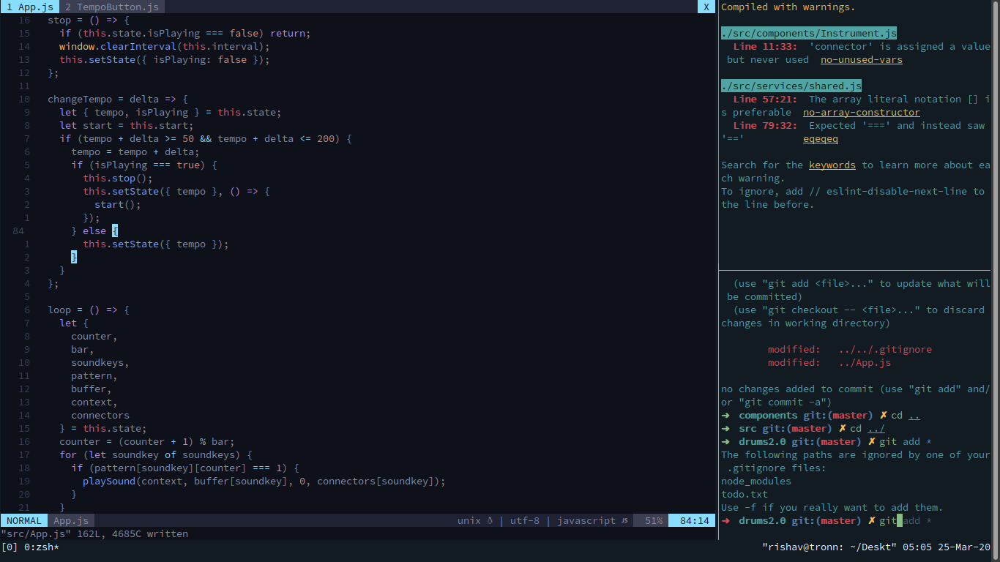

This will not be a tutorial on vim there are couple of great resources out there my favorites are vimtutor and [this lec](https://missing.csail.mit.edu/2020/editors/) from an IAP course. This post just tries to convince you what learning vim can give to you even in the era of modern text editors and ide 

## It's cool 
This was the reason I did it. I got to see vim in action at a summer school workshop on compilers. The guy was giving live demo of what an elf format in c++ and all I could focus on was the way he was moving in and out of code and different files. Also when I was learning React many top notch speakers and developers were using vim and it looked soo cool!. 

## It's fast 
I mean really fast you can take your editing speed to a whole level and there's no barrier like your normal mortal text editor, you can find different ways of doing the same thing and be quite good at it.
Also using tmux with it would boost productivity.

## You can use vim in real world
you can through plugins get all the cool and new feature like autocomplete and linters, but the things don't come out of the box. Don't worry though most of the editors provide vim key bindings and you can use them just by a click of a button. If you use vscode there's vim extension and it is downloaded and used by a lot of developers. It really gives you the speed of vim with modern tools, best of both worlds. 

## learning vim is great experience 
Learning vim was quite hands on and different. The novelty and the intrests did give me a quite engaging and fun learning experience.