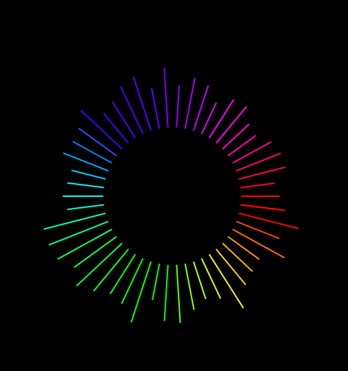
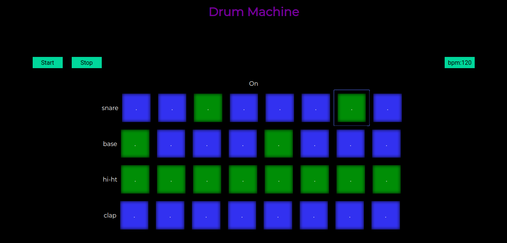

Diving in js and a music junky? Turns out there is a lot of cool things that you can do to take learning and your skill to a whole new level. This is a hitchhiker's guide to get you started on discovering this musical journey. The guide is in 2 parts the first part provides with the introduction to the tools you need while the other fills your head up with some ideas that you can work on.

*my own viz using canvas and web audio api*
## Basics

Well you need to look into some topics in order to get started . I didn't get through the basics and just dived into it, though this could also work i would not recommend it. By the way don't get intimidated there is not a lot to study before you can do some serious work.

### Web Audio Api
This basically enables you to control nearlly every aspect of music that you can possibly imagine in a nice and easy way. This abstracts all the audio engineering stuff and provides with a nice and simple graph based abstraction.

Great place to get started is the beloved [mdn docs](https://developer.mozilla.org/en-US/docs/Web/API/Web_Audio_API) there is also a [repo](https://github.com/mdn/webaudio-examples/) were all the examples code is provided.

If you want to look into a more comprehensive guide you can look at this [book](https://smus.com/webaudio-book/) by boris smus.

There is this [video](https://www.youtube.com/watch?v=56spBAgOYfg) which is also great.

### Canvas
This could help you to add a extra flavour to your project. You don't need to be good at this just some hands on basic stuff would do the trick. [mdn](https://developer.mozilla.org/en-US/docs/Web/API/Canvas_API) again is your friend here. This [tutorial](https://developer.mozilla.org/en-US/docs/Web/API/Canvas_API/Tutorial) covers all of the major aspects required.

## Projects 
Finally the fun stuff. The possibilties are endless here are some which could serve as an inspiration.

### Drum Machine

This is pretty cool and easy to get started with. You don't need to even use web audio api just load in some sounds with audio tags and map them with the buttons. You can also make this into a sequencer. Try adding features like changing tempo and allowing to load own sounds. This was my first project related to music and i am currently re implementing it with web audio api and more features.

### Synth
Yes you can make a whole synthesizer which does sound good. You can use web audio api to create oscillator nodes of different frequency and you can also create new ones with existing one by tweaking the audio. 

### Audio Visualizer
This is another cool project and you can go quite creative on this one. There in an analyzer node in providing the sound data in an array you can get frequency as well as amplitude. You can play with this array to display it any way you want by using Animation Frame. Try providing microphone support to vizualize live input. 

JS also has midi support which you can use to take the thing to a whole another level. There is also library like tonejs to which simplifies things and also adds more feature.